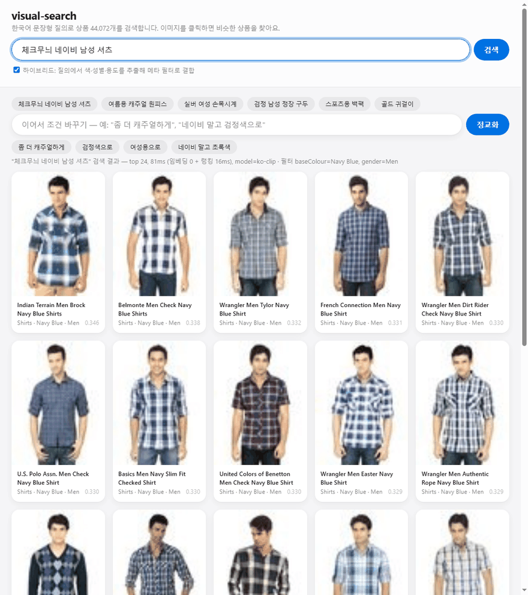

# visual-search — 한국어 멀티모달 상품 검색

[](https://github.com/ckc5800/visual-search/actions/workflows/ci.yml)



*데모 장면: ① "체크무늬 네이비 남성 셔츠" 검색 ② "실버 여성 손목시계" — 하이브리드
필터(baseColour=Silver, gender=Women 자동 추출) ③ "네이비 남성 셔츠"에서 "네이비 말고
초록색" 후속 발화로 정교화. 개별 스크린샷은 [docs/](docs/) 참고.*

한국어 문장형 질의("체크무늬 네이비 남성 셔츠")로 상품 이미지를 검색하는 프로젝트.
텍스트 RAG([portfolio-rag-agent](https://github.com/ckc5800/portfolio-rag-agent))에서 쓴
검색 평가 방법론(recall@k·MRR, 정직한 실패 기록)을 멀티모달로 확장하는 것이 목표다.

## 구조

- 데이터: [ashraq/fashion-product-images-small](https://huggingface.co/datasets/ashraq/fashion-product-images-small)
  — 상품 44.1K, 이미지(60×80) + 구조화 메타데이터(articleType, baseColour, gender, season, usage 등)
- 임베딩 모델 (A/B 비교 대상, `--model`로 선택):
  - `ko-clip` (기본): [Bingsu/clip-vit-base-patch32-ko](https://huggingface.co/Bingsu/clip-vit-base-patch32-ko) — 한국어 특화 CLIP, 151M, MIT
  - `jina-v2`: [jinaai/jina-clip-v2](https://huggingface.co/jinaai/jina-clip-v2) — 멀티링구얼 89개 언어, 865M, **CC-BY-NC 4.0(비상업)** — 본 저장소는 비상업 포트폴리오 용도로만 사용
- 검색: 임베딩 L2 정규화 후 numpy 내적(=코사인) 정확 탐색.
  44K 규모에서는 ANN이 불필요하다고 판단 — FAISS 등은 규모가 커질 때 도입.

## 사용

```bash
pip install -r requirements.txt

# 인덱스 구축 (스모크: --limit 200 은 스트리밍이라 전체 다운로드 없음)
python src/ingest.py --limit 200
python src/ingest.py                # 전체 44K

# 검색
python src/search.py "체크무늬 네이비 남성 셔츠"
python src/search.py --model jina-v2 --top-k 10 "여름용 캐주얼 원피스"
python src/search.py --image my_shirt.jpg     # 이미지로 비슷한 상품 찾기

# 데모 웹 UI (질의 → 상품 이미지 그리드, 이미지 클릭 → 비슷한 상품)
python -m uvicorn --app-dir src api:app --port 8321
```

이미지 질의 주의: 이 데이터셋은 60×80 저해상도라 JPEG 재인코딩(quality 75)만으로도
자기 자신과의 유사도가 1.000 → 0.912로 떨어진다(근사 중복 상품에 밀릴 수 있음).
무손실(PNG) 또는 원본 픽셀로 질의하면 자기 자신이 정확히 1위로 나오는 것 확인함.

## 평가 결과

한국어 50문항 × 전체 인덱스 44,072개, gold는 메타데이터 필터 기반(`eval/queries_ko.jsonl`).
측정: 2026-08-02, `python src/evaluate.py`, i7-4790 CPU. 재현 메타(모델 id·시각·top-10 id)는
`eval/results_ko-clip.json`의 `run`에 기록.

| model | hit@1 | hit@3 | hit@5 | hit@10 | precision@10 | MRR |
|---|---|---|---|---|---|---|
| ko-clip (임베딩 단독) | 0.720 | 0.820 | 0.860 | 0.900 | 0.652 | 0.780 |
| ko-clip + 하이브리드 필터 | **0.800** | 0.900 | 0.920 | **0.980** | **0.786** | 0.856 |
| m-clip (임베딩 단독) | 0.200 | 0.340 | 0.400 | 0.480 | 0.254 | 0.291 |
| m-clip + 하이브리드 필터 | 0.360 | 0.520 | 0.560 | 0.660 | 0.402 | 0.459 |
| en-clip-mt (opus 번역, 78M) | 0.520 | 0.680 | 0.740 | 0.860 | 0.578 | 0.623 |
| en-clip-mt + 하이브리드 필터 | 0.640 | 0.780 | 0.860 | 0.900 | 0.716 | 0.731 |
| en-clip-nllb (NLLB 번역, 600M) | 0.500 | 0.620 | 0.680 | 0.760 | 0.502 | 0.580 |
| en-clip-nllb + 하이브리드 필터 | 0.640 | 0.740 | 0.820 | 0.860 | 0.660 | 0.706 |
| en-clip-llm (LLM 3B+용어집 번역) | 0.560 | 0.720 | 0.800 | **0.920** | 0.578 | 0.667 |
| en-clip-llm + 하이브리드 필터 | 0.740 | 0.800 | 0.900 | 0.960 | 0.746 | 0.803 |
| RRF 앙상블 (ko-clip + llm) | 0.660 | 0.860 | 0.860 | 0.920 | 0.606 | 0.761 |
| RRF 앙상블 + 하이브리드 필터 | 0.800 | **0.920** | **0.940** | 0.980 | 0.766 | **0.859** |

### 번역 파이프라인 실험 — "번역 품질 → 검색 성능" (en-clip-*)

세 파이프라인 모두 이미지 인덱스가 m-clip과 동일(영어 CLIP ViT-B/32, `index_alias`로
재사용)해서, 순수하게 **한국어 질의를 어떻게 영어 벡터로 옮기느냐**만 비교한 실험이다.
번역문 전수는 각 `eval/results_en-clip-*.json`의 `translation` 필드에 기록.

- **정렬 < 번역**: 같은 인덱스인데 번역만 끼워도 hit@10 48%(m-clip)→86%(opus).
  다국어 "정렬"보다 명시적 "번역"이 커머스 어휘를 훨씬 잘 옮긴다.
- **번역기 크기 ≠ 품질**: NLLB 600M(76%)이 opus 78M(86%)보다 오히려 나쁘다.
  짧은 명사구 질의에서 환각("출근할 때 신는 검정 구두 → the god has a black mouth",
  "남성 청바지 → Men's underwear")하고, 콩글리시를 직역한다("원피스 → one-piece").
  일반 문장 번역용 학습 분포와 검색 질의의 스타일 불일치가 원인.
- **LLM(qwen2.5:3b) + 커머스 용어집이 최강**: 질의에 등장한 용어집 항목만 프롬프트에
  주입("원피스=dress, 운동화=sneakers"). 단독 hit@10 **92%로 ko-clip 단독(90%)을 추월**,
  하이브리드 96%. 전 모델이 실패했던 "인도 전통 여성 쿠르타"를 유일하게 해결(rr 1.0 —
  영어 CLIP은 kurta를 잘 알고, 병목은 오직 표기 변환이었다).
- **번역이 맞아도 실패하는 사례**: "여성 원피스 → women's dress"(정확)가 여전히 miss —
  번역이 아니라 영어 CLIP 랭킹의 한계. 파이프라인을 분해 기록한 덕에 실패 원인을
  번역/랭킹으로 귀속시킬 수 있다.
- **트레이드오프**: LLM 번역은 질의당 수 초(CPU) 지연. ko-clip 직접 인코딩(수십 ms)
  대비 정확도-지연 트레이드오프이며, 실서비스라면 번역 캐시·배치가 전제된다.

### 최종: jina-v2 3자 공정 비교 (10% 계통 서브셋 4,408개)

jina-v2는 512px EVA02 이미지 타워라 CPU에서 이미지당 ~7.6초 — 전체 44K는 ~83시간이라
10% 계통 샘플(stride 10)로 인제스트하고, ko-clip·m-clip은 기존 44K 인덱스를 같은
규칙으로 슬라이스(`--subset-stride 10`)해 **같은 4,408개에서 공정 비교**했다.
서브셋에선 gold 크기 분포가 달라지므로(30문항이 gold≤50) 위 44K 표와 수치를 직접
비교하면 안 되고, 이 표 안에서의 상대 비교만 유효하다.

| model (4,408개 서브셋) | hit@1 | hit@3 | hit@5 | hit@10 | precision@10 | MRR |
|---|---|---|---|---|---|---|
| jina-v2 단독 | 0.720 | **0.920** | 0.940 | **0.960** | 0.648 | 0.815 |
| jina-v2 + 하이브리드 | **0.820** | **0.960** | 0.960 | 0.960 | 0.718 | **0.883** |
| ko-clip 단독 | 0.700 | 0.820 | 0.860 | 0.920 | 0.614 | 0.767 |
| ko-clip + 하이브리드 | 0.780 | 0.880 | 0.920 | 0.960 | **0.744** | 0.834 |
| m-clip 단독 | 0.180 | 0.320 | 0.400 | 0.480 | 0.256 | 0.271 |
| m-clip + 하이브리드 | 0.340 | 0.540 | 0.620 | 0.680 | 0.368 | 0.449 |

- **대형 공동학습 멀티링구얼(jina-v2 865M)이 1위** — 단독 hit@10 96%, 하이브리드
  hit@1 82%·MRR 0.883. "다국어 모델은 한국어가 안 된다"가 아니라 **"증류 정렬(m-clip)이
  안 되는 것"** — 처음부터 다국어로 대비 학습하면 된다.
- **실패 문항이 ko-clip과 정확히 상보적**: jina-v2는 "쿠르타"를 번역 없이 1위 적중(rr
  1.0)하지만 "여성 원피스"·"빨간색 여성 원피스"(콩글리시)에서 실패. ko-clip은 정반대.
  **외래어는 멀티링구얼이, 콩글리시는 한국어 특화가 강하다** — 언어 현상별로 갈린다.
- **비용**: jina-v2 이미지 임베딩은 ko-clip 대비 CPU 기준 ~130배(4,408개 9.3시간 vs
  44K 42분). 정확도 우위는 분명하나 GPU 서빙이 전제 — CPU/저비용 환경이라면
  ko-clip+하이브리드(hit@10 96%)나 LLM 번역 파이프라인이 실용 선택지.

### RRF 앙상블 (`src/ensemble.py`)

ko-clip과 en-clip-llm은 실패 문항이 서로 달라(전자는 "쿠르타", 후자는 "여성 원피스")
Reciprocal Rank Fusion(K=60, depth=100)으로 융합했다. 결과는 **공짜 점심이 아니라 교환**:

- 하이브리드 앙상블이 hit@3 0.92·hit@5 0.94·MRR 0.859로 **중위 순위 지표 최고치** 갱신,
  gold≤50 구간 hit@10 100%.
- 그러나 hit@1(0.80)·hit@10(0.98)은 ko-clip 하이브리드와 동률, precision@10은 소폭
  하락(0.786→0.766). 실패 문항도 "쿠르타"(해결)와 "여성 원피스"(신규 탈락)가 맞교환 —
  한쪽 모델의 정답이 다른 쪽의 오답 순위에 희석될 수 있다.
- 결론: 지연(두 경로 실행)까지 고려하면 단독 ko-clip+하이브리드가 실용 우위,
  앙상블은 recall 중심 시나리오(후보 생성 후 리랭킹)에서 의미.

**m-clip(멀티링구얼 정렬 CLIP)은 한국어 특화 ko-clip에 전 지표에서 크게 밀린다.**
파이프라인 문제가 아님을 영어 질의로 검증했다 — "men navy blue checked shirt"는
정확히 네이비 남성 상의를 반환하지만, 같은 뜻의 "네이비 남성 셔츠"는 흰 속옷·갈색
셔츠로 흩어진다. mUSE 증류 기반 다국어 텍스트 타워가 한국어 커머스 어휘를 CLIP
공간에 제대로 정렬하지 못하는 것. "쿠르타"는 m-clip도 실패. 하이브리드 필터가
+18%p(hit@10) 구제하지만 랭킹 품질 자체는 못 살린다 — **도메인 언어 특화 모델의
가치를 보여주는 실측 근거.** (jina-v2 비교는 10% 서브셋 인제스트 완료 후 추가 예정)

**주의 — hit@k는 gold가 넓은 질의에서 후하게 나온다.** "남성 셔츠"처럼 gold가 수천 개면
top-10 안에 하나 들어가는 게 거의 자동이다. 그래서 gold 크기 구간별로 분해해 함께 본다:

| gold 크기 | 문항 | hit@1 | hit@10 | precision@10 | MRR |
|---|---|---|---|---|---|
| ≤50 (세부 조건) | 3 | 0.33 | 0.67 | **0.10** | 0.39 |
| 51~500 | 27 | 0.78 | 0.89 | 0.64 | 0.82 |
| 500+ (넓은 카테고리) | 20 | 0.70 | 0.95 | 0.75 | 0.78 |

조건이 좁아질수록 임베딩 단독 검색의 정밀도가 급락한다 — 색·성별 같은 구조화 조건을
메타 필터로 결합해야 한다는(로드맵 3) 실측 근거.

### 하이브리드 필터 (`--hybrid`, `src/hybrid.py`)

질의에서 색·성별·용도를 룰 기반(사전 매핑)으로 추출해 메타 필터로 걸고, 임베딩은
필터 통과분 안에서만 순위를 매긴다. 카테고리는 임베딩이 이미 잘 맞혀서 추출하지 않는다.
필터 통과분이 0이면 필터 무시(폴백), k 미만이면 그만큼만 반환(precision 분모는 k 고정).

- 세부 조건 구간(gold≤50)에서 precision@10 **0.10 → 0.53**, hit@10 0.67 → 1.00 —
  "좁은 조건은 임베딩 단독으로 안 된다"던 위 진단이 필터 결합으로 실제 해소됨을 확인.
- 하이브리드 후 남은 실패는 "인도 전통 여성 쿠르타" 1건 — 색·성별 필터로는 못 푸는
  어휘 이해 문제 (멀티링구얼 모델 비교의 관전 포인트).
- 공정성 주의: gold 정의와 필터가 같은 메타데이터 어휘를 공유하므로, 이 수치는
  "추출이 정확할 때"의 상한에 가깝다. 실서비스라면 추출 오류(동음이의어, 부정어 등)가
  추가 감점 요인이 된다.

hit@10 실패 5건 분석 (임베딩 단독 기준):

- **"인도 전통 여성 쿠르타"** — gold가 1,993개나 되는데 전부 놓침. 외래어 "쿠르타"를
  ko-clip이 이해하지 못하는 것으로 추정 (어휘 밖 단어에 취약).
- **"실버 여성 손목시계"(gold 129)·"분홍색 여성 샌들"(51)·"남아용 신발"(27)·
  "스포츠용 백팩"(83)** — 카테고리는 맞히지만 색상·성별·용도 세부 조건에서 어긋남.
- 구 "겨울 스웨터" 문항은 Sweaters의 season 라벨 87%가 Fall이라 gold 13개짜리
  메타데이터 함정이었음 — "니트 스웨터"로 교체(파일에 사유 주석). 질의 의도가
  메타데이터로 표현 안 되는 문항 4건은 `note`로 한계를 명시.

## 로드맵

1. ~~베이스라인~~: 인제스트 → 한국어 질의 top-k 검색 (완료)
2. ~~평가셋~~: 한국어 질의 50문항, 메타데이터 기반 gold 라벨 — 모델 6종 비교 완료
   (ko-clip / m-clip / 번역 3종 / jina-v2 서브셋)
3. ~~하이브리드 필터~~: 질의에서 구조화 조건(색·성별·용도) 추출 → 메타 필터 + 벡터 검색 결합 (완료, `src/hybrid.py`)
4. ~~대화형 정교화~~: 후속 발화로 필드 교체·병합, 부정어 처리 (완료, `/api/refine`)
5. ~~이미지 질의~~: 비슷한 상품 찾기 (완료, `/api/similar`)
6. **복합 질의**: 앵커 이미지 임베딩 + 텍스트 임베딩 가중 합성 질의 (완료, `/api/compose`, 문서화 안 되어 있던 항목 추가)

측정된 수치는 실측 시점의 명령·조건과 함께 이 README에 기록한다.
